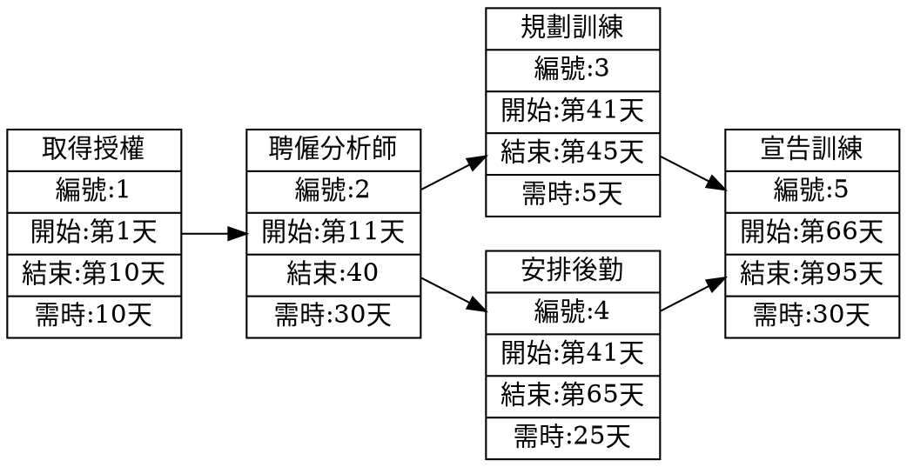
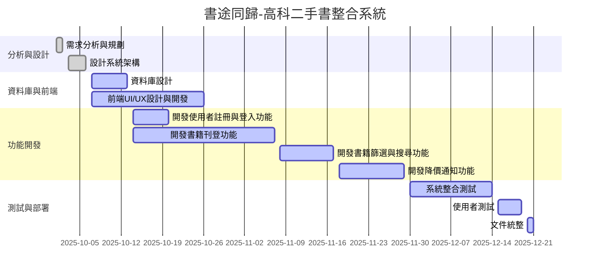

### 工作結構分解表

### PERT/CPM 圖

```graphviz
digraph {
	node[shape=record];
	rankdir="LR";
    no1 [label = "取得授權 | 編號:1 | 開始:第1天 | 結束:第10天 | 需時:10天"]
    no2 [label = "聘僱分析師 | 編號:2 | 開始:第11天 | 結束:40 | 需時:30天"]
    no1->no2
    no3 [label = "規劃訓練 | 編號:3 | 開始:第41天 | 結束:第45天 | 需時:5天"]
    no4 [label = "安排後勤 | 編號:4 | 開始:第41天 | 結束:第65天 | 需時:25天"]
    {rank=same;no3 no4}
    no2->no3
    no2->no4
    no5 [label = "宣告訓練 | 編號:5 | 開始:第66天 | 結束:第95天 | 需時:30天"]
    no3->no5
    no4->no5
}
```
### 關鍵路徑：1 → 2 → 3 → 5 → 6 → 7 → 9 → 10 → 11
#### 參與/分配到的任務
* 需求分析與規劃
* 設計系統架構
* 資料庫設計
* 開發使用者註冊與登入功能
* 開發書籍篩選與搜尋功能
* 系統整合測試
* 使用者測試
* 文件統整
### 甘特圖

``` mermaid
gantt
    title 書途同歸-高科二手書整合系統
    dateFormat  YYYY-MM-DD
    section 分析與設計
    需求分析與規劃          :done, task1, 2025-10-01, 2025-10-02
    設計系統架構            :done, task2, 2025-10-03, 2025-10-06

    section 資料庫與前端
    資料庫設計              :active, task3, 2025-10-07, 2025-10-13
    前端UI/UX設計與開發     :active, task8, 2025-10-07, 2025-10-26

    section 功能開發
    開發使用者註冊與登入功能 :active, task4, 2025-10-14, 2025-10-20
    開發書籍刊登功能         :active, task5, 2025-10-14, 2025-11-07
    開發書籍篩選與搜尋功能   :active, task6, 2025-11-08, 2025-11-17
    開發降價通知功能         :active, task7, 2025-11-18, 2025-11-29

    section 測試與部署
    系統整合測試            :active, task9, 2025-11-30, 2025-12-14
    使用者測試              :active, task10, 2025-12-15, 2025-12-19
    文件統整                :active, task11, 2025-12-20, 2025-12-21

```
