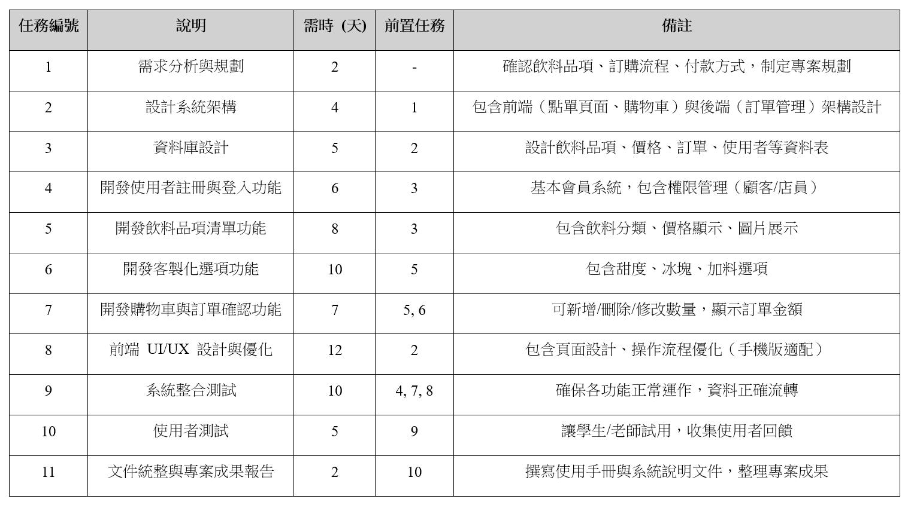
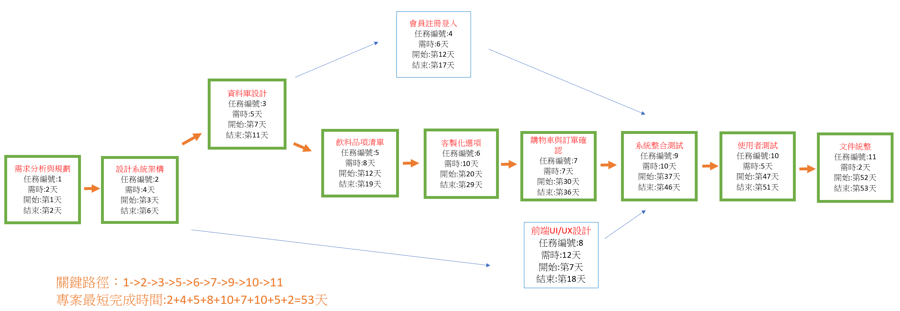
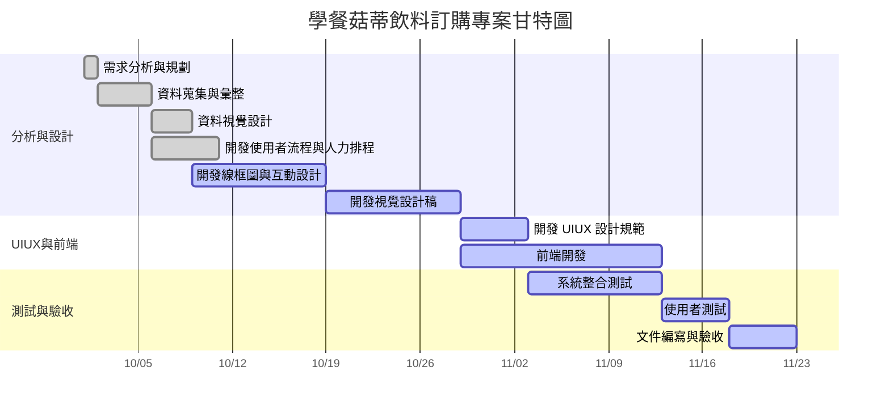

### 第12組 組員任務
| 組員   | 角色 | 任務                                                                 | 預估時間 |
|--------|------|--------------------------------------------------------------------------|----------|
| 陳貞伶 | 組長 | GitHub管理、模型設計、時程規劃 | 4-6 週   | 
| 蔡若筠 | 組員 | 分析與報告，視覺設計 | 3-5 週   | 
| 林郁芊 | 組員 | 分析與報告，表單設計 | 3-5 週   |
### 工作結構分解表

### PERT/CPM 圖

##### 關鍵路徑：1 → 2 → 3 → 5 → 6 → 7 → 9 → 10 → 11
### 甘特圖

