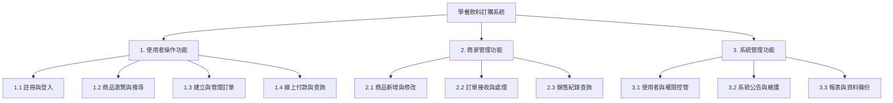
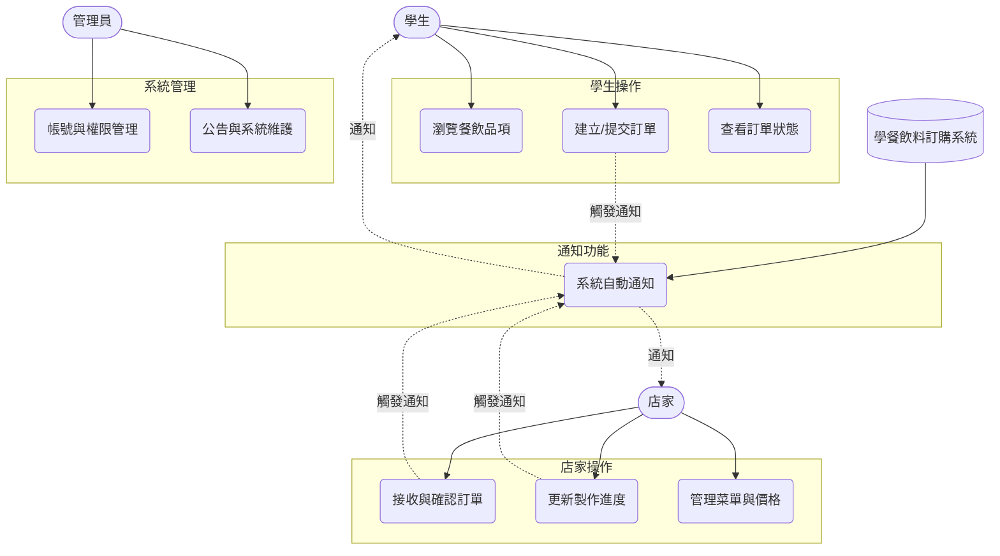
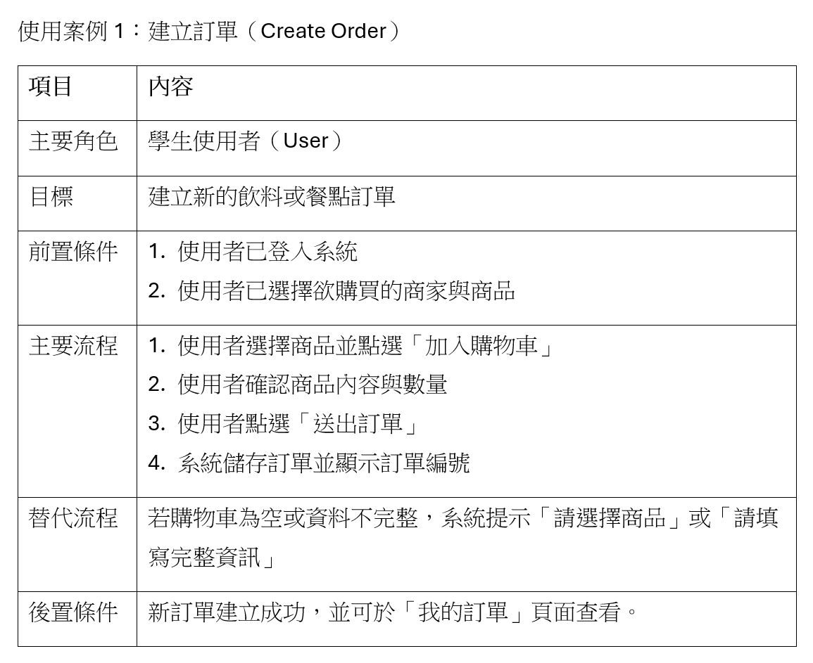
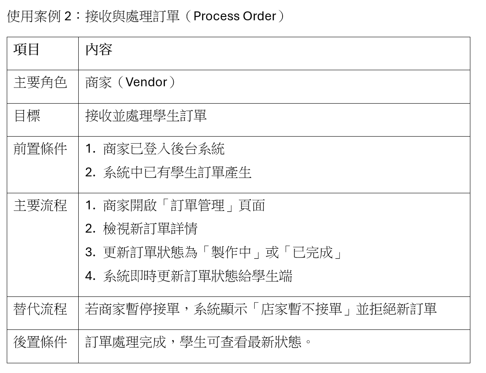
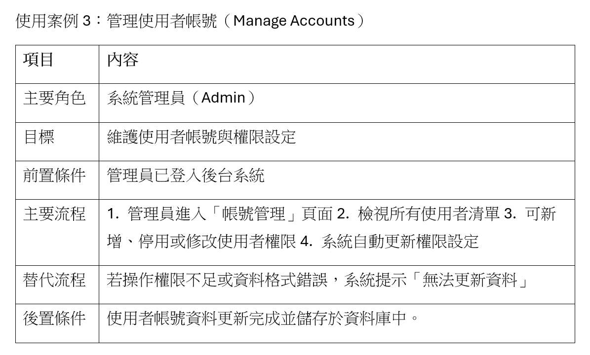

### 功能性需求與非功能性需求

#### 一、功能性需求
##### 1.使用者操作功能
* 用戶可從關鍵字搜尋、篩選和排序功能，以快速定位產品。
* 用戶能輕鬆建立訂單、增減品項、調整數量與備註；並隨時修改或取消未處理的訂單內容。
* 系統支援多種支付方式，用戶可即時查詢訂單狀態、詳細內容及付款紀錄。

##### 2.商家管理功能
* 商家可隨時新增、刪除或編輯飲料品項的名稱、描述、圖片，並調整其銷售價格。
* 系統即時通知商家新訂單，商家可確認接收、變更訂單狀態，並標記處理進度。
* 系統自動彙整銷售數據，商家可依日期、產品或金額篩選，查詢歷史銷售報告及統計。

##### 3.系統管理功能
* 系統管理員可新增、編輯或停用使用者帳號，並設定不同角色（如商家）的系統操作權限。
* 系統管理員可發布系統公告與最新消息，並排程維護時間，確保系統能夠穩定運行。
* 系統定時執行資料庫備份，確保所有使用者、訂單與產品資料的安全與可恢復性。

---
#### 二、非功能性需求
##### 1.性能
* 系統所有頁面，特別是菜單和結帳頁，應在 3 秒內完成加載。
* 系統必須能穩定處理至少 700 名用戶同時下單或瀏覽的操作。
* 為產品名稱、分類及描述建立高效的索引，優化查詢速度。

##### 2.安全性
* 用戶密碼、支付資訊、訂單細節皆須加密儲存 (SSL/TLS) 。
* 用戶個資的收集、使用與隱私權規定，皆須完全遵守相關法律法規。
* 對訂單備註欄、搜尋框等所有用戶輸入內容進行嚴格的驗證與淨化處理。

##### 3.可用性
* 使用負載平衡及異地備援，特別保障下單與支付服務。
* 重點測試結帳頁面在 iOS/Android 上的兼容性，確保付款流程順暢。
* 確保顏色對比度足夠，並為圖片和菜單提供替代文字。

##### 4.可維護性
* 特別關注訂單狀態和支付邏輯的代碼清晰度。
* 記錄所有支付失敗、庫存異常或訂單超時的日誌。
* 確保更新飲品價格、新增活動時不影響用戶下單。

##### 5.可擴展性
* 系統架構須支援水平擴展，以彈性應對未來用戶訂單量的激增。
* 定期歸檔歷史訂單，確保核心交易表（如當日訂單）保持高性能。

---
### 功能分解圖

---
### 使用案例圖

