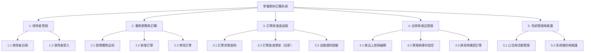

### 功能分解圖

```mermaid
graph TD
    A[學餐飲料訂購系統]

    %% 1. 使用者管理
    A --> B1[1. 使用者管理]
    B1 --> B11[1.1 使用者註冊]
    B1 --> B12[1.2 使用者登入]

    %% 2. 餐飲瀏覽與訂購
    A --> B2[2. 餐飲瀏覽與訂購]
    B2 --> B21[2.1 瀏覽餐飲品項]
    B2 --> B22[2.2 新增訂單]
    B2 --> B23[2.3 修改訂單]

    %% 3. 訂單與進度追蹤
    A --> B3[3. 訂單與進度追蹤]
    B3 --> B31[3.1 訂單狀態查詢]
    B3 --> B32[3.2 訂單進度更新（店家）]
    B3 --> B33[3.3 自動通知提醒]

    %% 4. 店家與商品管理
    A --> B4[4. 店家與商品管理]
    B4 --> B41[4.1 商品上架與編輯]
    B4 --> B42[4.2 價格與庫存設定]
    B4 --> B43[4.3 接收與確認訂單]

    %% 5. 系統管理與報表
    A --> B5[5. 系統管理與維護]
    B5 --> B51[5.1 公告與活動管理]
    B5 --> B52[5.2 系統備份與維護]
```

### 使用案例圖

```mermaid
%%{init: {'theme': 'default'}}%%
graph TD

    %% 角色
    A([ 學生 ]):::actor
    B([ 店家 ]):::actor
    C([ 管理員 ]):::actor
    S[(學餐飲料訂購系統)]:::system

    %% 學生使用案例
    subgraph 學生操作
        UC1(瀏覽餐飲品項)
        UC2(建立/提交訂單)
        UC3(查看訂單狀態)
    end

    %% 店家使用案例
    subgraph 店家操作
        UC5(接收與確認訂單)
        UC6(更新製作進度)
        UC7(管理菜單與價格)
    end

    %% 管理員使用案例
    subgraph 系統管理
        UC8(帳號與權限管理)
        UC9(公告與系統維護)
    end

    %% 通知功能
    subgraph 通知功能
        UC10(系統自動通知)
    end

    %% 角色關聯
    A --> UC1
    A --> UC2
    A --> UC3

    B --> UC5
    B --> UC6
    B --> UC7

    C --> UC8
    C --> UC9

    S --> UC10
    UC10 -.通知.-> A
    UC10 -.通知.-> B

    %% Extend / include 關係
    UC2 -.觸發通知.-> UC10
    UC5 -.觸發通知.-> UC10
    UC6 -.觸發通知.-> UC10
```
