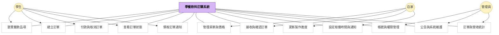

### 使用案例圖

```mermaid
%%{init: {'theme': 'default'}}%%
graph TD
    A[學餐飲料訂購系統]

    %% 主要角色
    U1((學生))
    U2((店家))
    U3((管理員))

    %% 學生使用案例
    U1 --> S1[瀏覽餐飲品項]
    U1 --> S2[建立訂單]
    U1 --> S3[付款與取消訂單]
    U1 --> S4[查看訂單狀態]
    U1 --> S5[領取訂單通知]

    %% 店家使用案例
    U2 --> S6[管理菜單與價格]
    U2 --> S7[接收與確認訂單]
    U2 --> S8[更新製作進度]
    U2 --> S9[設定取餐時間與通知]

    %% 管理員使用案例
    U3 --> S10[帳號與權限管理]
    U3 --> S11[公告與系統維護]
    U3 --> S12[訂單與營收統計]

    %% 系統核心
    A --- S1
    A --- S2
    A --- S3
    A --- S4
    A --- S5
    A --- S6
    A --- S7
    A --- S8
    A --- S9
    A --- S10
    A --- S11
    A --- S12

    %% 節點配色
    style A fill:#d7b6f6,stroke:#a678d3,stroke-width:2px,color:#000,font-weight:bold

    style U1 fill:#fff3c4,stroke:#c2a83e,stroke-width:1px
    style U2 fill:#fff3c4,stroke:#c2a83e,stroke-width:1px
    style U3 fill:#fff3c4,stroke:#c2a83e,stroke-width:1px

    style S1 fill:#ffffff,stroke:#bcbcbc
    style S2 fill:#ffffff,stroke:#bcbcbc
    style S3 fill:#ffffff,stroke:#bcbcbc
    style S4 fill:#ffffff,stroke:#bcbcbc
    style S5 fill:#ffffff,stroke:#bcbcbc
    style S6 fill:#ffffff,stroke:#bcbcbc
    style S7 fill:#ffffff,stroke:#bcbcbc
    style S8 fill:#ffffff,stroke:#bcbcbc
    style S9 fill:#ffffff,stroke:#bcbcbc
    style S10 fill:#ffffff,stroke:#bcbcbc
    style S11 fill:#ffffff,stroke:#bcbcbc
    style S12 fill:#ffffff,stroke:#bcbcbc
```
