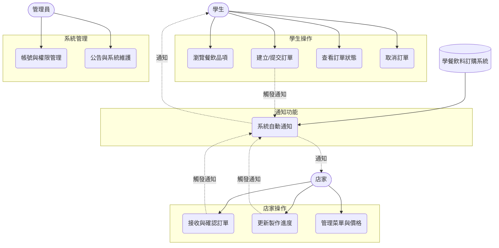

### 使用案例圖

```mermaid
%%{init: {'theme': 'default'}}%%
graph TD

    %% 角色
    A([ 學生 ]):::actor
    B([ 店家 ]):::actor
    C([ 管理員 ]):::actor
    S[(學餐飲料訂購系統)]:::system

    %% 學生使用案例
    subgraph 學生操作
        UC1(瀏覽餐飲品項)
        UC2(建立/提交訂單)
        UC3(查看訂單狀態)
        UC4(取消訂單)
    end

    %% 店家使用案例
    subgraph 店家操作
        UC5(接收與確認訂單)
        UC6(更新製作進度)
        UC7(管理菜單與價格)
    end

    %% 管理員使用案例
    subgraph 系統管理
        UC8(帳號與權限管理)
        UC9(公告與系統維護)
    end

    %% 通知功能
    subgraph 通知功能
        UC10(系統自動通知)
    end

    %% 角色關聯
    A --> UC1
    A --> UC2
    A --> UC3
    A --> UC4

    B --> UC5
    B --> UC6
    B --> UC7

    C --> UC8
    C --> UC9

    S --> UC10
    UC10 -.通知.-> A
    UC10 -.通知.-> B

    %% Extend / include 關係
    UC2 -.觸發通知.-> UC10
    UC5 -.觸發通知.-> UC10
    UC6 -.觸發通知.-> UC10

   

```
