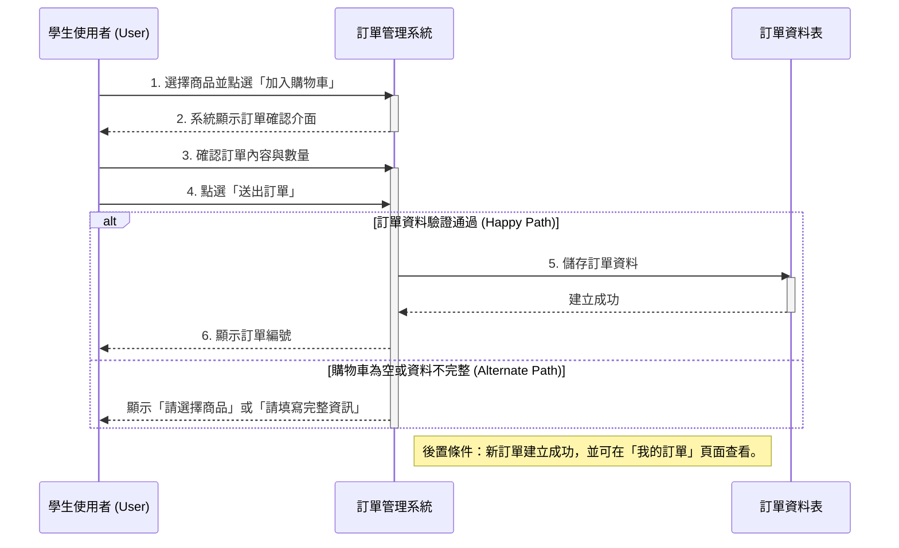
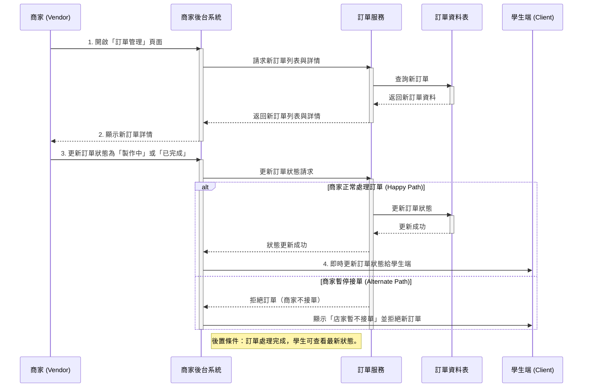
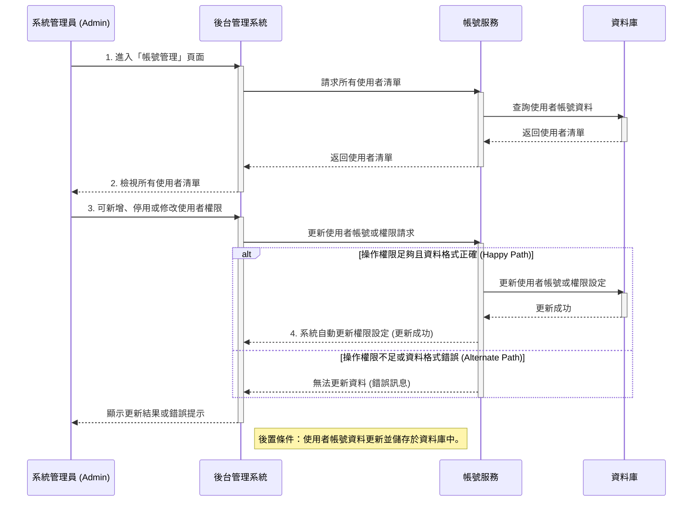
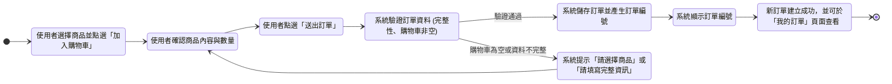
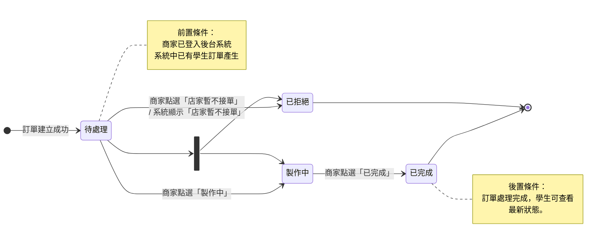
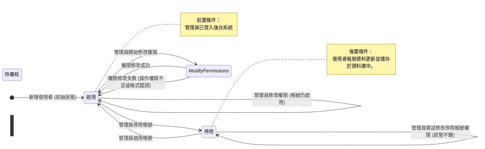

## UML類別圖

---

## 使用案例1：建立訂單 UML循序圖

```mermaid
sequenceDiagram


    participant User as 學生使用者 (User)
    participant System as 訂單管理系統
    participant DB as 訂單資料表
    
    %% 流程 1: 選擇商品並加入購物車 (對應原任務的「點選新增任務」和「顯示輸入介面」的組合)
    User->>System: 1. 選擇商品並點選「加入購物車」
    activate System
    System-->>User: 2. 系統顯示訂單確認介面
    deactivate System

    %% 流程 2: 確認訂單內容與數量
    User->>System: 3. 確認訂單內容與數量
    activate System

    %% 流程 3: 送出訂單
    User->>System: 4. 點選「送出訂單」

    %% 替代流程 (Alternate Flow)
    alt 訂單資料驗證通過 (Happy Path)
        System->>DB: 5. 儲存訂單資料
        activate DB
        DB-->>System: 建立成功
        deactivate DB
        
        System-->>User: 6. 顯示訂單編號
        
    else 購物車為空或資料不完整 (Alternate Path)
        System-->>User: 顯示「請選擇商品」或「請填寫完整資訊」
    end
    
    %% 在 alt 區塊結束後，才停用系統
    deactivate System

    Note right of System: 後置條件：新訂單建立成功，並可在「我的訂單」頁面查看。
```

## 使用案例2：接受與處理訂單 UML循序圖

```mermaid
sequenceDiagram
    participant Vendor as 商家 (Vendor)
    participant AdminSystem as 商家後台系統
    participant OrderService as 訂單服務
    participant DB as 訂單資料表
    participant StudentClient as 學生端 (Client)

    %% 前置條件: 商家已登入後台系統, 系統中已有學生訂單產生

    %% 流程 1 & 2: 開啟訂單管理頁面並檢視新訂單詳情
    Vendor->>AdminSystem: 1. 開啟「訂單管理」頁面
    activate AdminSystem
    AdminSystem->>OrderService: 請求新訂單列表與詳情
    activate OrderService
    OrderService->>DB: 查詢新訂單
    activate DB
    DB-->>OrderService: 返回新訂單資料
    deactivate DB
    OrderService-->>AdminSystem: 返回新訂單列表與詳情
    deactivate OrderService
    AdminSystem-->>Vendor: 2. 顯示新訂單詳情
    deactivate AdminSystem

    %% 流程 3: 更新訂單狀態 & 流程 4: 更新狀態給學生端
    Vendor->>AdminSystem: 3. 更新訂單狀態為「製作中」或「已完成」
    activate AdminSystem
    AdminSystem->>OrderService: 更新訂單狀態請求
    activate OrderService

    alt 商家正常處理訂單 (Happy Path)
        OrderService->>DB: 更新訂單狀態
        activate DB
        DB-->>OrderService: 更新成功
        deactivate DB
        OrderService-->>AdminSystem: 狀態更新成功
        AdminSystem->>StudentClient: 4. 即時更新訂單狀態給學生端
    else 商家暫停接單 (Alternate Path)
        OrderService-->>AdminSystem: 拒絕訂單（商家不接單）
        AdminSystem->>StudentClient: 顯示「店家暫不接單」並拒絕新訂單
    end
    
    deactivate OrderService
    deactivate AdminSystem

    Note right of AdminSystem: 後置條件：訂單處理完成，學生可查看最新狀態。
```

## 使用案例3：管理使用者帳號 UML循序圖

```mermaid
sequenceDiagram


    participant Admin as 系統管理員 (Admin)
    participant AdminSystem as 後台管理系統
    participant AccountService as 帳號服務
    participant DB as 資料庫

    %% 前置條件: 管理員已登入後台系統

    %% 流程 1 & 2: 進入「帳號管理」頁面並檢視使用者清單
    Admin->>AdminSystem: 1. 進入「帳號管理」頁面
    activate AdminSystem
    AdminSystem->>AccountService: 請求所有使用者清單
    activate AccountService
    AccountService->>DB: 查詢使用者帳號資料
    activate DB
    DB-->>AccountService: 返回使用者清單
    deactivate DB
    AccountService-->>AdminSystem: 返回使用者清單
    deactivate AccountService
    AdminSystem-->>Admin: 2. 檢視所有使用者清單
    deactivate AdminSystem

    %% 流程 3 & 4: 新增/停用/修改使用者權限並更新
    Admin->>AdminSystem: 3. 可新增、停用或修改使用者權限
    activate AdminSystem
    AdminSystem->>AccountService: 更新使用者帳號或權限請求
    activate AccountService

    alt 操作權限足夠且資料格式正確 (Happy Path)
        AccountService->>DB: 更新使用者帳號或權限設定
        activate DB
        DB-->>AccountService: 更新成功
        deactivate DB
        AccountService-->>AdminSystem: 4. 系統自動更新權限設定 (更新成功)
    else 操作權限不足或資料格式錯誤 (Alternate Path)
        AccountService-->>AdminSystem: 無法更新資料 (錯誤訊息)
    end
    
    deactivate AccountService
    AdminSystem-->>Admin: 顯示更新結果或錯誤提示
    deactivate AdminSystem

    Note right of AdminSystem: 後置條件：使用者帳號資料更新並儲存於資料庫中。

```

---

## 使用案例1：建立訂單 UML活動圖

```mermaid

 stateDiagram-v2
    direction LR

    [*] --> 選擇商品
    選擇商品: 使用者選擇商品並點選「加入購物車」
    選擇商品 --> 確認訂單
    確認訂單: 使用者確認商品內容與數量
    確認訂單 --> 送出訂單按鈕
    送出訂單按鈕: 使用者點選「送出訂單」
    送出訂單按鈕 --> 訂單資料驗證
    訂單資料驗證: 系統驗證訂單資料 (完整性、購物車非空)
    
    訂單資料驗證 --> 儲存訂單: 驗證通過
    訂單資料驗證 --> 提示錯誤: 購物車為空或資料不完整
    提示錯誤: 系統提示「請選擇商品」或「請填寫完整資訊」
    提示錯誤 --> 確認訂單 %% 返回確認步驟，讓使用者修正

    儲存訂單: 系統儲存訂單並產生訂單編號
    儲存訂單 --> 顯示訂單編號
    顯示訂單編號: 系統顯示訂單編號
    顯示訂單編號 --> 訂單建立完成
    訂單建立完成: 新訂單建立成功，並可於「我的訂單」頁面查看
    訂單建立完成 --> [*]


```

## 使用案例2：接受與處理訂單 UML活動圖

```mermaid

 stateDiagram-v2
    direction LR

    state "待處理" as Pending
    state "製作中" as InProgress
    state "已完成" as Completed
    state "已拒絕" as Rejected

    [*] --> Pending: 訂單建立成功

    Pending --> InProgress: 商家點選「製作中」
    InProgress --> Completed: 商家點選「已完成」

    Pending --> Rejected: 商家點選「店家暫不接單」 / 系統顯示「店家暫不接單」
    
    Completed --> [*]
    Rejected --> [*]

    state 訂單流程 <<fork>>
    Pending --> 訂單流程
    訂單流程 --> InProgress
    訂單流程 --> Rejected

    note right of Pending
        前置條件：
        商家已登入後台系統
        系統中已有學生訂單產生
    end note
    
    note right of Completed
        後置條件：
        訂單處理完成，學生可查看最新狀態。
    end note


```

## 使用案例3：管理使用者帳號 UML活動圖

```mermaid

 stateDiagram-v2
    direction LR

    state "啟用" as Active
    state "停用" as Inactive
    state "待審核" as PendingReview

    [*] --> Active: 新增使用者 (初始狀態)
    
    Active --> Inactive: 管理員停用帳號
    Inactive --> Active: 管理員啟用帳號
    
    Active --> Active: 管理員修改權限 (帳號仍啟用)
    Inactive --> Inactive: 管理員嘗試修改停用帳號權限 (狀態不變)
    
    state "修改權限流程" as ModifyPermissions <<fork>>
    Active --> ModifyPermissions: 管理員開始修改權限
    ModifyPermissions --> Active: 權限修改成功
    ModifyPermissions --> Active: 權限修改失敗 (操作權限不足或格式錯誤)
    
    note right of Active
        前置條件：
        管理員已登入後台系統
    end note
    
    note right of Inactive
        後置條件：
        使用者帳號資料更新並儲存於資料庫中。
    end note


```
