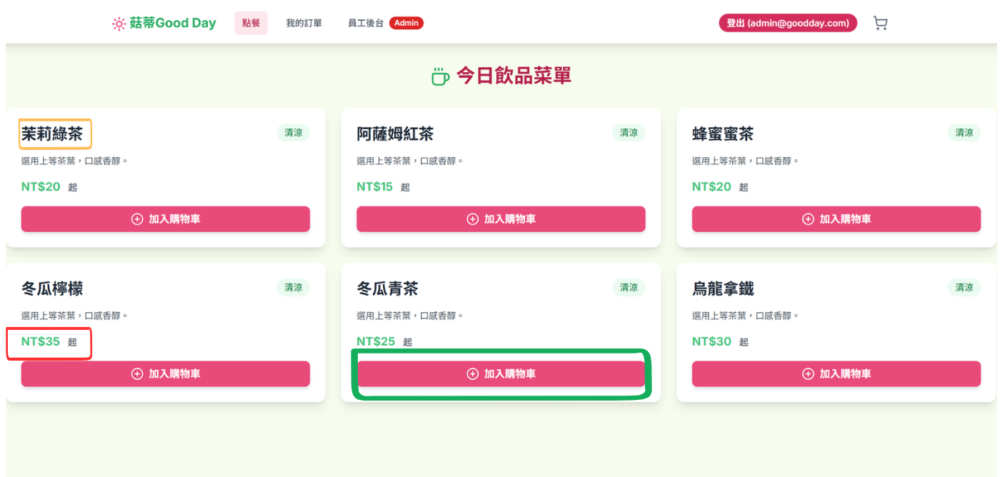

## 輸入欄位資料型態與驗證規則

會員與管理員登入：
| 欄位名稱     | 資料型態| 驗證規則                                    |
| -------- | --------- | --------------------------------------- | 
| 電子郵件    | String    | 必填、Email 必須包含一個 "@" 符號和一個點 "." | 
| 密碼 | String    | 必填、至少6個字元、欄位不可為空                      | 

## 點餐畫面資料型態與驗證規則
| 欄位名稱     | 資料型態| 驗證規則                                    |
| -------- | --------- | --------------------------------------- | 
| 飲料名稱    | String    | 必填、長度限制10個中文字 | 
| 價格 | String    | 必填、為正數、加上「NT$」和「起」作為前綴和後綴。                      | 
| 加入購物車 | Action    | 按鈕應在商品有庫存且可購買的狀態下顯示並啟用。                      | 

