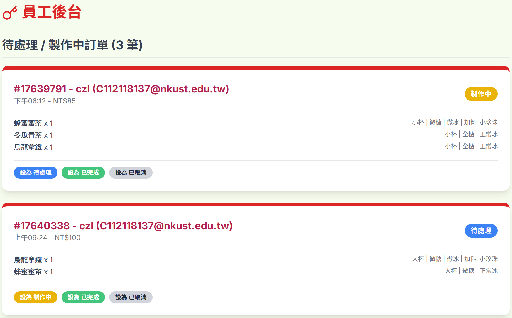

## 輸入欄位資料型態與驗證規則

會員與管理員登入：
| 欄位名稱     | 資料型態| 驗證規則                                    |
| -------- | --------- | --------------------------------------- | 
| 電子郵件    | String    | 必填、Email 必須包含一個 "@" 符號和一個點 "." | 
| 密碼 | String    | 必填、至少6個字元、欄位不可為空                      | 

## 點餐畫面資料型態與驗證規則
| 欄位名稱     | 資料型態| 驗證規則                                    |
| -------- | --------- | --------------------------------------- | 
| 飲料名稱    | String    | 必填、長度限制10個中文字 | 
| 價格 | String    | 必填、為正數、加上「NT$」和「起」作為前綴和後綴。                      | 
| 加入購物車 | Action    | 按鈕應在商品有庫存且可購買的狀態下顯示並啟用。                      | 

## 員工後臺管理資料型態與驗證規則
| 欄位名稱     | 資料型態| 驗證規則                                    |
| -------- | --------- | --------------------------------------- | 
| 訂單編號   | String    | 必填、唯一識別碼，系統自動生成，不可重複。 | 
| 訂單時間 | Datetime    | 必填、記錄準確的下單時間。                      | 
| 訂單總價 | Numeric    | 必填、必須是非負數；前端呈現時需加上貨幣符號 (NT$)。                     | 
| 訂單狀態   | String    | 必填、只能是系統預設的固定值之一 (如：待處理、製作中、已完成、已取消)。 | 
| 購買數量 | Integer   | 必填、必須是>=1的正整數。                      | 
